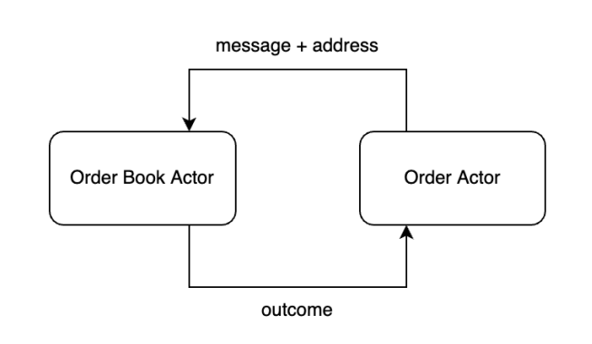
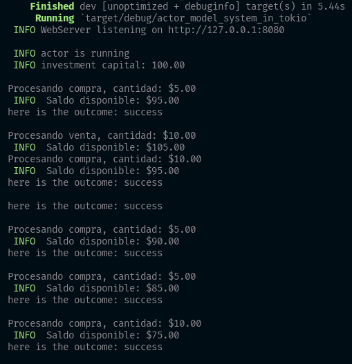
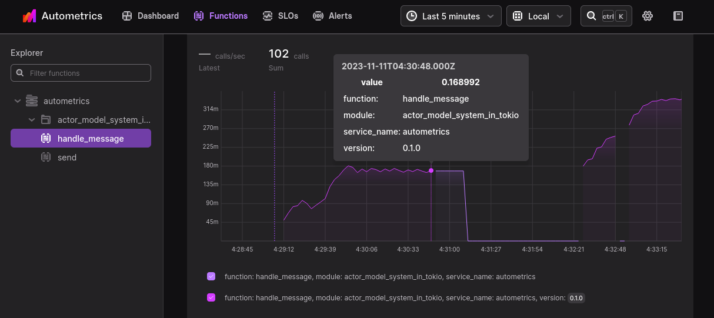

# Actor Model System in Tokio and Instrumented with Autometrics



The Actor Model System with Tokyo is a powerful combination that allows you to build concurrent and parallel systems in Rust without having any external infrastructure such as a database.

## About
This demo presents a simple financial asset exchange system, where concurrent actors submit buy and sell orders to a single order book based on mpsc which stands for "multi-producer, single-consumer", the order book updates its status in consequence with the generation of messages. Additionally, a web server is implemented to expose Prometheus metrics through Autometrics and expose performance information.



## Local Observability Development

### Terminal 1 - To run program.
``` 
cargo run
```
<p align="justify">Spin up local Prometheus and start scraping your application that listens on [Prometheus](http://localhost:8080/metrics).</p>

### Terminal 2 - To run Autometrics (see pre requirements).
```
am start :8080
```
Explore your request metrics in [Autometrics](http://127.0.0.1:6789/explorer/#/functions/details/s/autometrics/m/actor_model_system_in_tokio/handle_message)



<hr/> 

## Pre Requirements

### Install the Autometrics CLI

The recommended installation for macOS is via [Homebrew](https://brew.sh/):

```
brew install autometrics-dev/tap/am
```

Alternatively, you can download the latest version from the [releases page](https://github.com/autometrics-dev/am/releases)

The easiest way to get up and running with this application is to clone the repo and get a local Prometheus setup using the [Autometrics CLI](https://github.com/autometrics-dev/am).


Read more about Autometrics in Rust [here](https://github.com/autometrics-dev/autometrics-rs) and general docs [here](https://docs.autometrics.dev/).